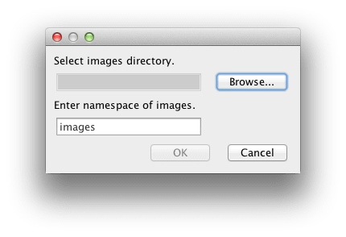
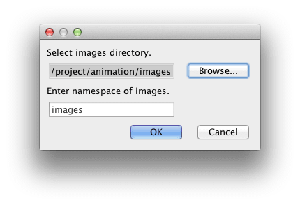
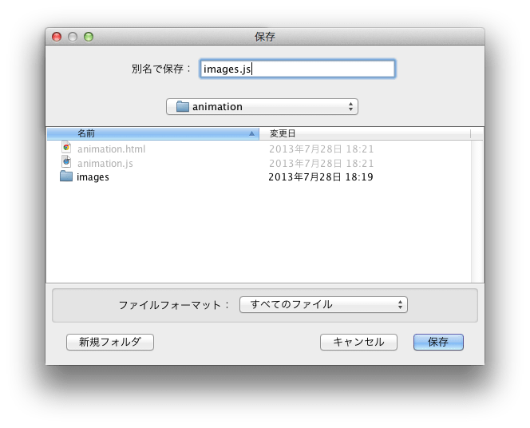

# img2js
Toolkit for CreateJS（以下、TFC）で書きだした複数の画像をbase64化して、1個のJavaScriptファイルに纏めるツールです。

## 使い方
1. img2js/out/artifacts/img2js_jar/img2js.jar をダウンロード [[direct link](https://github.com/beryu/img2js/blob/master/out/artifacts/img2js/img2js.jar?raw=true)]
2. ダウンロードした img2js.jar をダブルクリック  

3. [Browse...]ボタンを押下
4. TFCで出力したimagesディレクトリを選択  

5. （デフォルトから変更したい場合）名前空間を設定
6. OKボタンを押下
7. 保存先を選択

